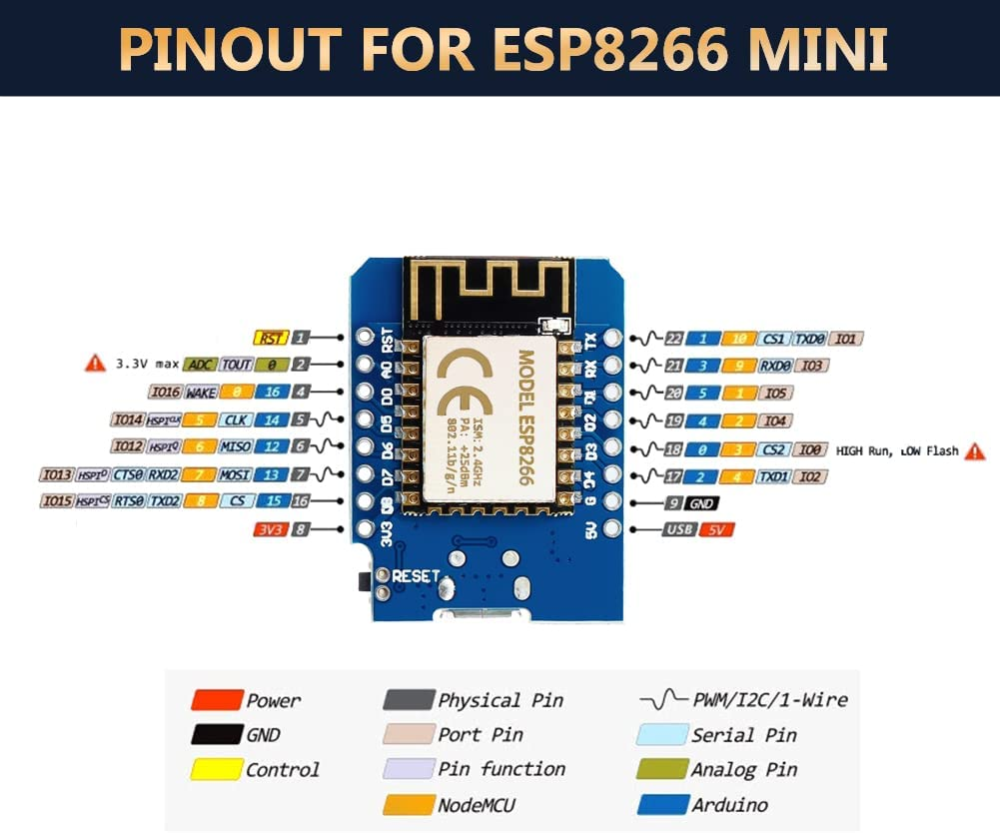

# ESP LED Controller

## Features
* Controls individually addressable LED strips supported by FastLED (like WS28121, WS2812, WS2812B)
* Compatible with both ESP32 and ESP8266 platforms
* WiFi capable 
    * creates a default AP, listening to http://192.168.4.1
    * allows joining an existing 2.4GHz network
    * serves a webpage for managing LED - strip size, mode, brightness

## Configuration.h

This file configured various default settings, like:
* ESP pin used to drive the LED data (defaults are referenced below)
* WiFi AP name/password
* LED strip type, size, default brightness

## Basic components, enclosure and wiring

The most basic setup would use 5v LEDs and power both the ESP board and LED strip directly from a 5v DC of the appropriate Amperage / Wattage

Example components:
* ESP32 - https://www.amazon.com/gp/product/B086MGH7JV
* JST SM 3PIN LED Connector - https://www.amazon.com/gp/product/B075K4HLTQ
* DC power connector - https://www.amazon.com/gp/product/B01N8VV78D
* LED strip - https://www.amazon.com/gp/product/B08B59CBK9
* DC 5v adapter - https://www.amazon.com/gp/product/B078RXZM4C

3A DC adapter can power a strip of 144 LEDs well enough, even longer depending on color and brightness.

### ESP32 

__LED_PIN_STRIP = 12__ - GPIO12 - above VIN (5V), GND and GPIO13

### ESP8266 

__LED_PIN_STRIP = 2__ - this is D4 (physical pin 17) above 5V and GND 

### 3D Printable Enclosure

Below is a very basic enclosure for housing the ESP32 linked in components. It can be printed in PLA, PETG or any other similar hard filament.

* [ESP32 Case STL](stl/ESP32Case.stl)
* [ESP32 Lid STL](stl/ESP32Lid.stl)

The board is mounted above the DC connector with 3mm screws

