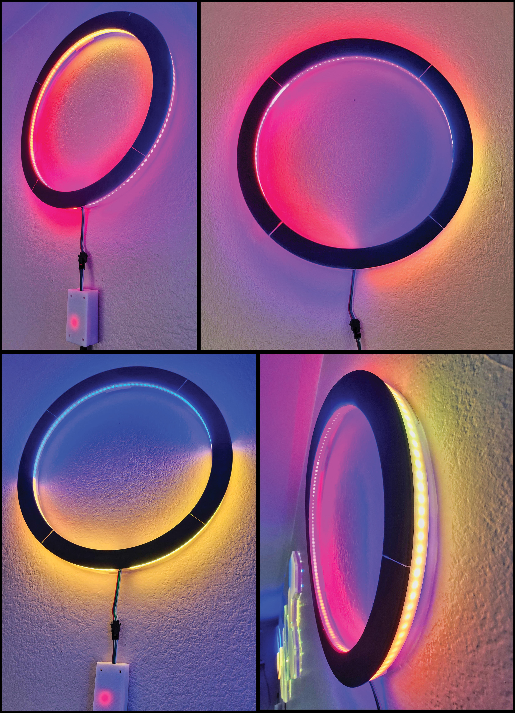
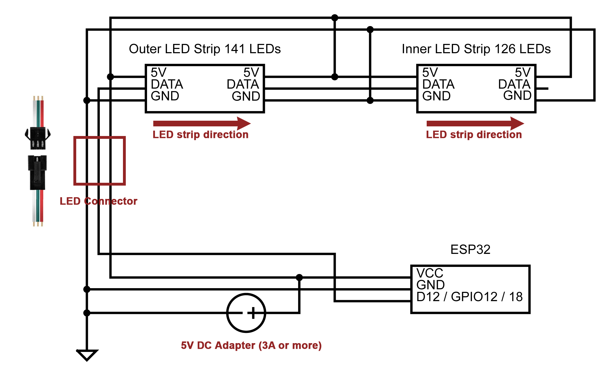

# RingLight ESP LED Controller

## Features
* Two LED rings - outer (141 LEDs) and inner (126 LEDs) wired up in series for a total of 267 LEDs
* Controlled by ESP32 (most stable). Code is compatible with ESP8266, but I was suffering stability issues with wifi and longer LED strips.
* WiFi connected 
    * creates a default AP, listening to http://192.168.4.1
    * capable of joining existing 2.4GHz networks
    * serves a webpage for managing LED - strip size, mode, brightness   

## Components
* ESP32 - https://www.amazon.com/gp/product/B086MGH7JV
* JST SM 3PIN LED Connector - https://www.amazon.com/gp/product/B075K4HLTQ
* DC power connector - https://www.amazon.com/gp/product/B01N8VV78D
* WS2812B LED strip high density strips 144 LEDs per strip x 2 - https://www.amazon.com/gp/product/B088FKZWDQ
* DC 5v adapter - https://www.amazon.com/gp/product/B078RXZM4C

## 3D filament 
I used the ones below but likely many others will work. Make sure the white is translusent enough, print a 3 layer sheet and put it infront of some LEDs.
* ESUN PLA+ warm white - https://www.amazon.com/gp/product/B01EKEMIIS
* ERYONE Matte PLA black - https://www.amazon.com/gp/product/B08HX1XF55

## Assembly and wiring

Print 4 of each:
* [Dark Ring](stl/DarkRing.stl)
* [Light Ring](stl/LightRing.stl)
* [Bridge Hanger](stl/Hanger.stl)

Assemble as described here. Rotate the light ring pieces by 45 degrees so they end in the middle of a dark ring. This improves stability.

Cut the two LED strips to 141 and 126 LEDs. Keep as many of the existing wires and connectors as possible.

Wire the strips data in series - outer first then inner. The beginning of the outer ring data pin goes to the connector data pin.

Join the power wires in parallel: 5V/VCC together to the 5V connector pin; GND(-) together to GND on connector pin.

By default in `Configuration.h` the LEDs data is connected to pin 12 on the ESP, but most other GPIO pins can be used if needed

__LED_PIN_STRIP = 12__ - GPIO12 - above VIN (5V), GND and GPIO13

## Configuration.h

This file configures various default settings, like:
* ESP pin used to drive the LED data (defaults are referenced below)
* WiFi AP name/password
* LED strip type, size, default brightness

### 3D Printable Enclosure

Below is a very basic enclosure for housing the ESP32 linked in components. It can be printed in PLA, PETG or any other similar hard filament.

* [ESP32 Case STL](stl/ESP32Case.stl)
* [ESP32 Lid STL](stl/ESP32Lid.stl)

The board is mounted above the DC connector with 3mm screws

